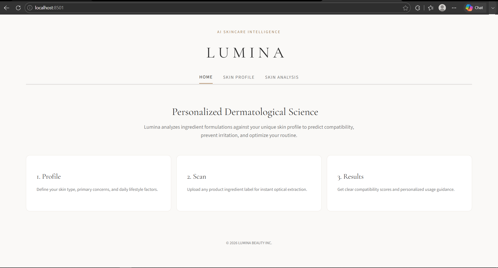
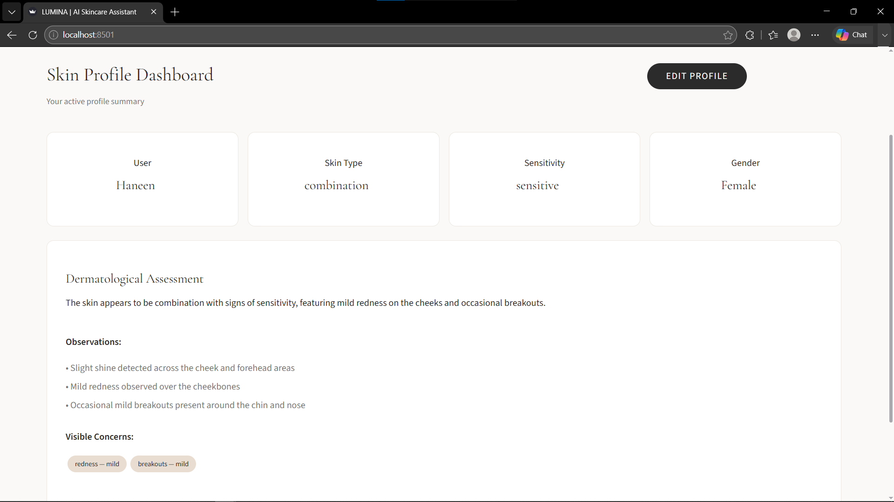
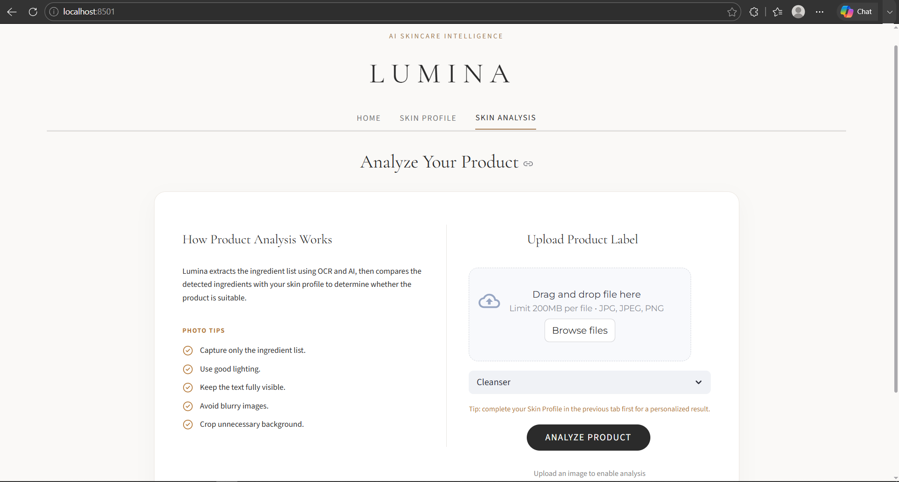
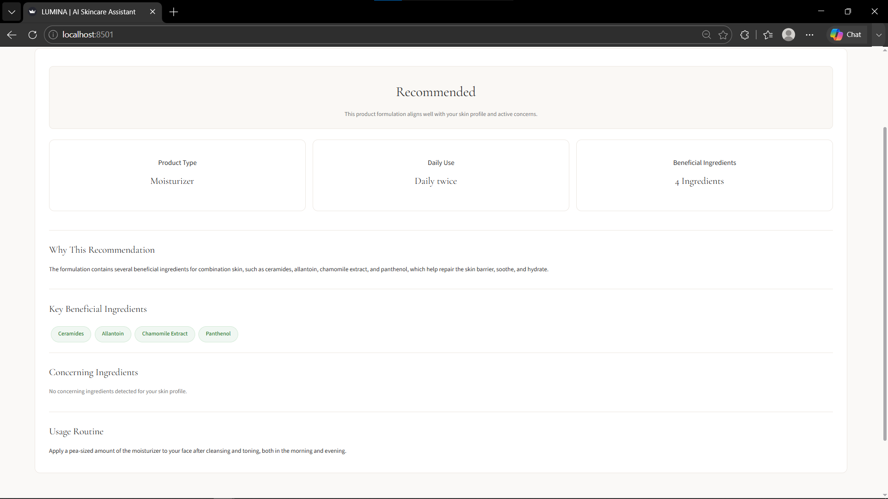

# 🚀 [Tips Hindawi](https://www.tipshindawi.com/) Challenge (June–July) 2026

> 🏆 This repository is my official submission for the [ **Tips Hindawi** ](https://www.tipshindawi.com/) **Challenge (June–July) 2026**.

## 👤 Participant

| Field            | Value                                |
| ---------------- | ------------------------------------ |
| Full Name        |     Haneen Hosney El-ladam           |
| Project Name     |    Lumina – AI Skincare Intelligence |
| GitHub Username  |     HanenEl                          |
| Challenge Batch  | June–July 2026                       |
| Training Program | Large Language Models (LLMs) Program |
| Organization     | [**Edrak for Ai**](https://edrak4ai.com/en)                         |

---

# 📖 Project Overview

Every skin is unique, and every skincare decision matters. Lumina is built to make choosing skincare products easier, clearer, and more personal. By helping users understand ingredients and discover products that truly suit their skin, Lumina transforms uncertainty into confidence one skincare choice at a time.


---

# ✨ Features

- **Personalized Skin Profiling** – Create a comprehensive skin profile through guided assessments, sensitivity evaluation, and AI-powered facial analysis.

- **AI-Powered Product Analysis** – Analyze skincare products based on your unique skin profile to determine compatibility, suitability, and tailored recommendations.

- **Intelligent Ingredient Insights** – Understand the role of each ingredient, discover beneficial components, and identify potential concerns for your skin.

- **Personalized Usage Guidance** – Receive clear explanations, practical usage advice, and routine guidance tailored to your skin's needs.

- **Seamless Label Scanning** – Simply upload a product label image and let Lumina transform complex ingredient lists into clear, personalized insights.

---

# 🖼️ System Workflow

```text
                User Opens Lumina
                       │
                       ▼
               Skin Profile Setup
                       │
        ┌──────────────┴──────────────┐
        ▼                             ▼
 Knows Skin Type             Doesn't Know Skin Type
        │                             │
        └──────────────┬──────────────┘
                       ▼
      Sensitivity Assessment + Face Analysis
                       │
                       ▼
      Personalized Skin Profile Generated
                       │
                       ▼
        Upload Product Label & Select Category
                       │
                       ▼
      EasyOCR → Knowledge Base → Mistral-7B
                       │
                       ▼
      Personalized Recommendation & Insights
```

---


# 🛠️ Technologies Used

| **Category** | **Technology** | **Purpose** |
|--------------|----------------|-------------|
| **Frontend** | Streamlit | Interactive web application interface |
| **AI Model** | Google Gemini 3.5 Flash Lite | Skin profile assessment from facial images and questionnaire responses |
| **LLM** | Mistral-7B-Instruct-v0.2 | AI-powered skincare product compatibility analysis based on ingredients and skin profile |
| **OCR** | EasyOCR | Extracts ingredient lists from product label images |
| **Image Processing** | Pillow (PIL) | Loads and preprocesses uploaded facial images before AI analysis |
| **Backend** | FastAPI | Handles AI inference requests |
| **Server** | Uvicorn | Runs the FastAPI application |
| **Networking** | Pyngrok | Exposes the backend server during development |
| **Deep Learning** | PyTorch | Executes model inference |
| **Model Framework** | Hugging Face Transformers | Loads and runs pretrained language models |
| **Data Validation** | Pydantic | Validates structured AI outputs |
| **LLM Utilities** | LangChain Core | Parses structured LLM responses |
| **Text Processing** | Regex  | Cleans and normalizes OCR-extracted text before ingredient matching |
| **Fuzzy Matching** | difflib | Matches OCR-extracted ingredients with the knowledge base using approximate string matching |
| **Knowledge Base** | Custom JSON Files | Stores ingredient data, skin type compatibility, and safety information |
| **Infrastructure** | Kaggle Notebooks (T4 GPU) | Hosts and accelerates model inference |

---

# ⚙️ Installation

### 1. Clone the Repository
```bash
git clone https://github.com/HanenEl/Lumina.git
cd Lumina
```

### 2. Install Dependencies
```bash
pip install -r requirements.txt
```

---

# 🚀 Usage

1. **Launch Application:** Open the Streamlit app in your browser.
2. **Skin Profile Assessment:** Complete the quick quiz (or directly confirm your skin type).
3. **Facial Image Analysis (Optional):** Upload a photo for AI-assisted skin evaluation.
4. **Product Ingredient Label:** Upload an image of any skincare product label.
5. **Select Category:** Choose the product type (*e.g., Cleanser, Moisturizer, Sunscreen*).
6. **AI Ingredient Extraction:** Lumina automatically scans and extracts the ingredient list.
7. **Personalized Evaluation:** Ingredients are cross-referenced against your specific skin profile.
8. **Get Insights:** Receive a detailed safety evaluation, ingredient breakdown, warnings, and usage tips.

---

# 📸 Demo

<p align="center">
  <a href="https://drive.google.com/file/d/1CjZIjUyPrdJXN7NkoTUWT4fMoK16-_Bx/view?usp=drive_link">
    
  </a>
  <br>
  <a href="https://drive.google.com/file/d/1CjZIjUyPrdJXN7NkoTUWT4fMoK16-_Bx/view?usp=drive_link">
    
  </a>
  <a href="https://drive.google.com/file/d/1CjZIjUyPrdJXN7NkoTUWT4fMoK16-_Bx/view?usp=drive_link">
    
  </a>
  <a href="https://drive.google.com/file/d/1CjZIjUyPrdJXN7NkoTUWT4fMoK16-_Bx/view?usp=drive_link">
    
  </a>
</p>

<p align="center">
  <a href="https://drive.google.com/file/d/1CjZIjUyPrdJXN7NkoTUWT4fMoK16-_Bx/view?usp=drive_link">
    <strong>Watch the Full Demo Video</strong>
  </a>
</p>


---

# 📊 Results

Lumina successfully delivers personalized skincare product evaluations by combining user-specific skin profiles with AI-powered ingredient analysis.

The application can:

* Build a personalized skin profile using questionnaires and optional facial image analysis.
* Extract ingredient lists directly from product labels using OCR.
* Analyze ingredient compatibility based on the user's skin characteristics.
* Identify beneficial and potentially concerning ingredients.
* Generate clear explanations, personalized recommendations, warnings, and usage guidance for each product.


---

# 🔮 Future Improvements

* Support barcode scanning for faster product identification.
* Expand the skincare knowledge base with additional ingredients and formulations.
* Recommend complete skincare routines instead of evaluating individual products.
* Track users' skincare history and product compatibility over time.
* Improve facial skin analysis with a dedicated dermatology vision model.
* Deploy the application as a cloud-hosted web service.

---

# 📚 About the Challenge

This project was developed as part of the [**Tips Hindawi**](https://www.tipshindawi.com/) **Challenge (June–July) 2026**.

[Tips Hindawi](https://www.tipshindawi.com/) is the internships department of [**Edrak for Ai**](https://edrak4ai.com/en), and the challenge encourages participants to build real-world projects, apply practical skills, and showcase their work through GitHub.

For more information about the challenge, training programs, and upcoming batches, visit the official [Tips Hindawi](https://www.tipshindawi.com/) website.

---

# 📄 License

This project is shared for educational and portfolio purposes.
